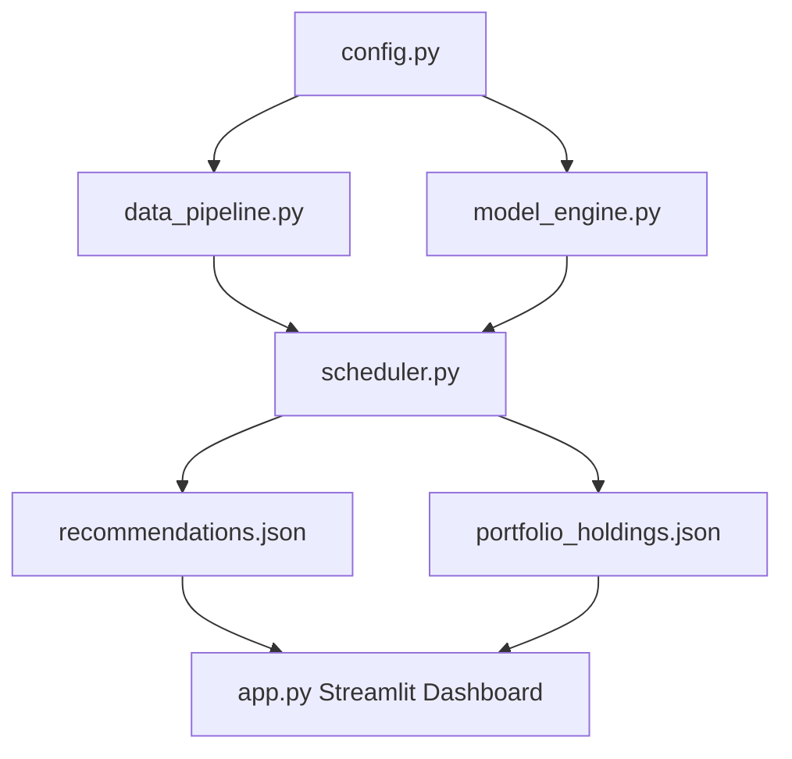

# Modular Technical Trading Assistant & Portfolio Monitor (Green Energy & EV Focus)

This implementation plan targets the **Green Energy & EV** sector, developing the technical data pipelines, predictive models, and a portfolio dashboard. It includes a live holdings monitor that factors in Indian brokerage transaction fees (Zerodha, Groww, Angel One) and alerts when stock prices fall below critical cost-basis or structural stop-loss thresholds.

---

## User Review Required

We have refined the plan to focus on the Green Energy & EV sector and add the requested portfolio tracking system:

> [!IMPORTANT]
> **1. Target Sector: Green Energy & EV**
> - **Tickers**: `OLAELEC.NS` (Ola Electric), `TATAPOWER.NS`, `RELIANCE.NS`, `BOSCHLTD.NS`
> - **Macro Focus**: Crude Oil Prices (WTI crude futures `CL=F` on `yfinance` or FRED spot `DCOILWTICO`).
> - **Rationale**: Global oil prices are a major macro indicator for alternative energy adoption. High oil prices make green energy and EVs more economically competitive. Using yfinance futures `CL=F` keeps data daily, real-time, and highly synchronized.
>
> **2. Portfolio Holdings Tracker & Transaction Charges Calculation**
> We will add an interactive portfolio dashboard where you can input holdings:
> - **Inputs**: Ticker, Quantity (Shares), Purchase Price, Purchase Date, and Broker (Zerodha, Groww, Angel One, or Custom).
> - **Fee Matrix**: We will implement exact tax formulas for Indian equity delivery:
>   - **STT (Securities Transaction Tax)**: 0.1% on buy and sell.
>   - **Brokerage**: Zerodha (₹0), Groww (₹20 or 0.05% max), Angel One (₹0).
>   - **Stamp Duty**: 0.015% on buy.
>   - **Exchange Transaction Charges**: 0.00322% on buy and sell.
>   - **SEBI turnover fees**: 0.0001% on buy and sell.
>   - **GST**: 18% applied to Brokerage + Exchange Charges + SEBI fees.
>
> **3. Net-of-Fees P&L and Stop-Loss / Break-Even Alerts**
> The dashboard will dynamically compute:
> - **Gross P&L** vs **Net P&L** (deducting buy-side and projected sell-side charges).
> - **Break-Even Price**: The minimum sell price required to cover all transaction charges.
> - **Structural Stop-Loss (Net)**: Volatility-adjusted stop-loss boundary incorporating fees.
> - **Alert Flag**: Visually highlights and warns when the current live stock price falls below either the Break-Even Price or the Stop-Loss Threshold.

---

## Proposed Changes

We will build the application in `d:\Lithin\Personal Work\Trading Assistant`.

### Files to Implement

#### [NEW] requirements.txt
Contains: `yfinance`, `scikit-learn`, `xgboost`, `pandas-datareader`, `feedparser`, `plotly`, `streamlit`, `pandas`, `numpy`.

#### [NEW] config.py
Configures Green Energy & EV sector details:
- Focus tickers: `OLAELEC.NS`, `TATAPOWER.NS`, `RELIANCE.NS`, `BOSCHLTD.NS`.
- Macro ticker symbols: `CL=F` (Crude Oil Futures), falling back to FRED code `DCOILWTICO`.
- Brokerage rate configurations (Zerodha, Groww, Angel One).
- Model parameters (XGBoost/RandomForest default settings).

#### [NEW] broker_charges.py
A module containing helper functions to compute precise transaction fees, GST, stamp duty, SEBI fees, and STT for buys and sells based on chosen broker platforms. Calculates the Break-Even Price for holdings.

#### [NEW] sentiment_analyzer.py
Fetches Yahoo Finance RSS feed for the Green Energy & EV tickers and scores headline sentiments using a fast rule-based financial dictionary.

#### [NEW] data_pipeline.py
- Downloads daily historical OHLCV data for Green Energy & EV tickers and macro indicators (`CL=F`, `DCOILWTICO`).
- Calculates technical layers (14-day RSI, 14-day ATR, 50-day SMA, 200-day SMA) using pandas.
- Merges data, handling alignment and Z-scores for relative strength features.

#### [NEW] model_engine.py
- Prepares classification (direction) and regression (magnitude) targets.
- Trains dual ensemble models per stock (XGBoost with Random Forest fallback).
- Saves trained models to `models/`.
- Computes predictions and execution brackets (Take-Profit & Stop-Loss).

#### [NEW] app.py
Streamlit UI additions:
- **Portfolio Holdings Editor**: Simple inputs (Ticker, Quantity, Buy Price, Buy Date, Broker) to add, view, and delete active stock purchases. Persists to a local `portfolio_holdings.json` file.
- **Live Monitoring Dashboard**:
  - Fetches latest market closing prices.
  - Displays tables of current portfolio holdings with: Cost Price, Net Purchase Value, Live Market Price, Live Net Value, Net P&L (amount and percentage), Predicted 5-Day Value.
  - **Live Alarm Indicator**: A warning banner/status column highlighting any stock currently trading below its cost break-even or structural stop-loss.
- **Technical Analysis Board**: Plots candlestick charts with indicators (SMA, RSI, ATR).
- **Sentiment & News Panel**: Displays Yahoo Finance headlines and sentiment scores.

---

## Verification Plan

### Automated Tests
1. **Charges Verification**: A test run of `broker_charges.py` comparing output with Zerodha's online brokerage calculator to verify mathematical accuracy.
2. **Model Training & Inference**: Run `model_engine.py` to confirm model output files are written and correct signals are generated.

### Manual Verification
1. **Portfolio Add/Remove**: Verify through the Streamlit dashboard that adding and removing transactions works correctly, updates the table, and calculates fees instantly.
2. **Alert Triggering**: Input a dummy holding with a very high purchase price to verify that the "Loss Alert" warning triggers, displays in red, and correctly computes the break-even.
