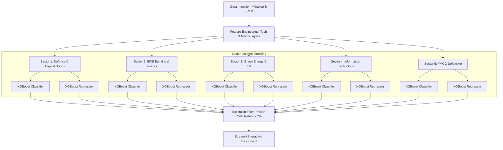

# Multi-Sector Technical Trading Assistant & Portfolio Screener
## Comprehensive Architecture & Implementation Reference

This document serves as the architectural reference for implementing a multi-sector technical trading assistant and portfolio screener. It details how the system scales across different industry sectors, integrates specialized macroeconomic features, models market direction and magnitude via independent ensemble trees, and renders recommendations.

---

## 1. Executive & Architectural Overview

The goal of this application is to orchestrate completely open-source financial APIs, advanced feature engineering, and independent machine learning models grouped by market sectors into a unified, free Technical Trading Assistant dashboard.

---

## 2. Sector Cluster Mapping & Parameters

To isolate sector-specific dynamics, the framework splits data and model pipelines into five distinct sector groups. Each group targets specific tickers and merges corresponding macroeconomic features:

| Sector Rank / Group | Key Ticker Targets | Macro Economic Focus Feature | FRED / yfinance Source Code |
| :--- | :--- | :--- | :--- |
| **1. Defence & Capital Goods** | `HAL.NS`, `BEL.NS`, `ASTRAMICRO.NS` | Government CAPEX Allocations & Budgets | `GFCFGDINM` (Gross Fixed Capital Formation) |
| **2. BFSI (Banking & Finance)** | `HDFCBANK.NS`, `ICICIBANK.NS`, `AXISBANK.NS` | RBI Repo Rates, Credit Growth % | `IRSTCB01INM156N` (Policy Rate), `CRDQINAPABIS` |
| **3. Green Energy & EV** | `TATAPOWER.NS`, `RELIANCE.NS`, `BOSCHLTD.NS` | Crude Oil Spot Prices | `CL=F` (WTI Crude Futures) or `DCOILWTICO` |
| **4. Information Technology** | `TCS.NS`, `INFY.NS`, `CYIENT.NS` | NASDAQ strength, Dollar Index | `^IXIC` (NASDAQ), `DX-Y.NYB` (Dollar Index) |
| **5. FMCG (Defensive Group)** | `ITC.NS`, `HINDUNILVR.NS`, `NESTLEIND.NS` | Consumer Price Index (CPI), Rural Spend | `INDCPIALLMINMEI` (India CPI) |

---

## 3. Unified Technical Data Infrastructure

The technical infrastructure runs daily/nightly scripts using free, open-source libraries:
- **`yfinance`**: Extracts OHLCV data for stock tickers and market indexes. A minimum of 3-5 rolling years is fetched to build deep training sets.
- **`pandas_datareader`**: Interacts with the St. Louis FRED database to pull monthly/quarterly macroeconomic indices.
- **`feedparser`**: Reads XML RSS streams from Yahoo Finance for real-time news headlines.

### 3.1 Feature Extraction Layers
For every stock ticker, the data pipeline engineers the following features:
1. **Momentum Layer**: 14-Day Relative Strength Index (RSI).
2. **Volatility Layer**: 14-Day Average True Range (ATR).
3. **Trend Layer**: 50-Day & 200-Day Simple Moving Averages (SMA).
4. **Macro Blend Layer**: Sector-specific macro indicators normalized to rolling Z-scores:
   $$Z_t = \frac{X_t - \mu_{\text{rolling}}}{\sigma_{\text{rolling}}}$$
   This ensures macro features are stationary and scale-invariant before feeding into model trees.

---

## 4. The AI/ML Modeling Blueprint

Each sector maintains its own independent pair of machine learning engines (XGBoost with Random Forest fallback). 

### 4.1 Model 1: Directional Classifier (Will it Rise?)
- **Objective**: Predicts binary probability that the price in 5 trading days ($t+5$) is higher than today's close ($t$).
- **Target Variable**: 
  $$\text{Target\_Direction}_t = \begin{cases} 1 & \text{if } \text{Close}_{t+5} > \text{Close}_t \\ 0 & \text{otherwise} \end{cases}$$
- **Evaluation Metric**: Classification ROC-AUC and Precision (minimizing false positives is critical).

### 4.2 Model 2: Magnitude Regressor (By How Much?)
- **Objective**: Predicts the continuous percentage change over the next 5-day horizon.
- **Target Variable**:
  $$\text{Target\_Return}_t = \frac{\text{Close}_{t+5} - \text{Close}_t}{\text{Close}_t}$$
- **Evaluation Metric**: Mean Absolute Error (MAE) and R-squared ($R^2$).

---

## 5. Execution & Risk Management Logic

Recommendations are generated based on a strict multi-layered validation filter:
- **Confidence Check**: Classifier's probability score must exceed **75%**.
- **Minimum Margin Alpha**: Regressor's predicted 5-day return must be greater than **+2.00%**.
- **Volatility Stop-Loss**: The system calculates a structural volatility stop-loss boundary:
  $$\text{Stop\_Loss\_Price} = \text{Current\_Price} - (1.5 \times \text{ATR})$$
- **Target Take-Profit**: Set at the magnitude regressor's predicted price:
  $$\text{Take\_Profit\_Price} = \text{Current\_Price} \times (1 + \text{Predicted\_Return})$$

---

## 6. Multi-Sector Interface Dashboard Layout

The user interface is built using Streamlit in dark mode, structured as follows:
1. **Sidebar Watchlist Configuration**: Allows updating lists of target tickers per sector.
2. **Global Sector Overview**: Grid showing the heat-maps, average sentiment scores, and macro trends for each of the 5 sectors.
3. **Ranked Recommendations Board**: A unified matrix displaying the best trading opportunities filtered across all sectors.
4. **Interactive Candlestick Charts**: Rendered using Plotly, displaying 50/200 SMA lines, volume panels, and secondary tabs for RSI and ATR overlays.
5. **Headless CLI Execution**: Enabled by CLI triggers (e.g. `python scheduler.py --all-sectors --retrain`) to run nightly cron tasks.
